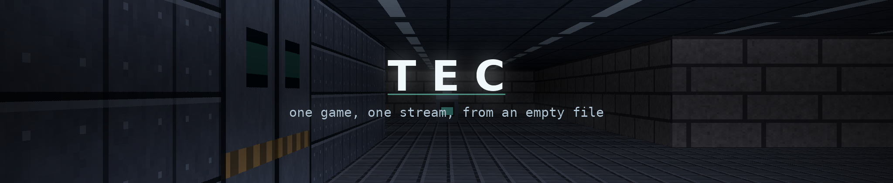
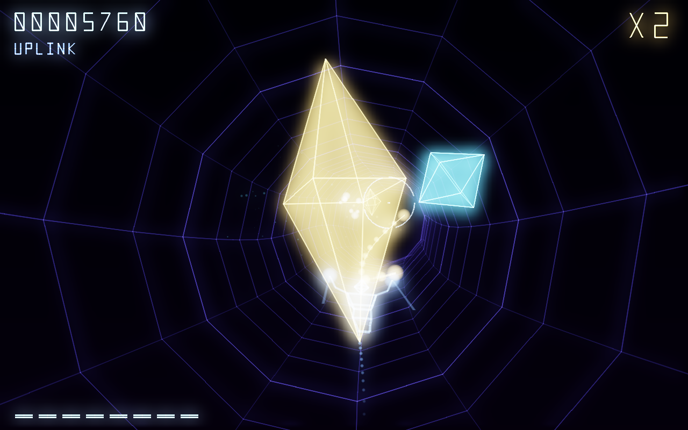
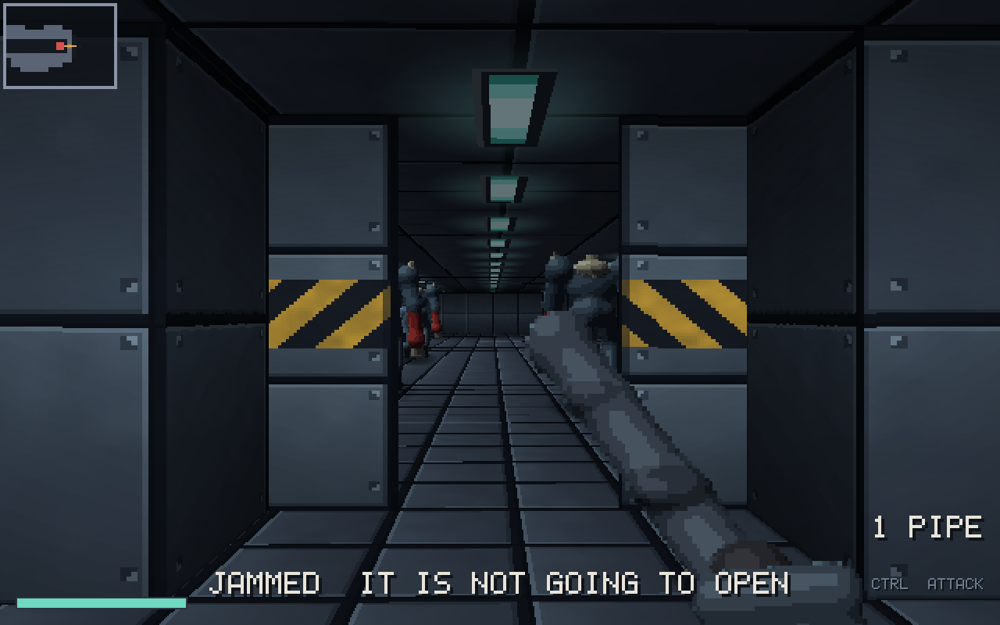
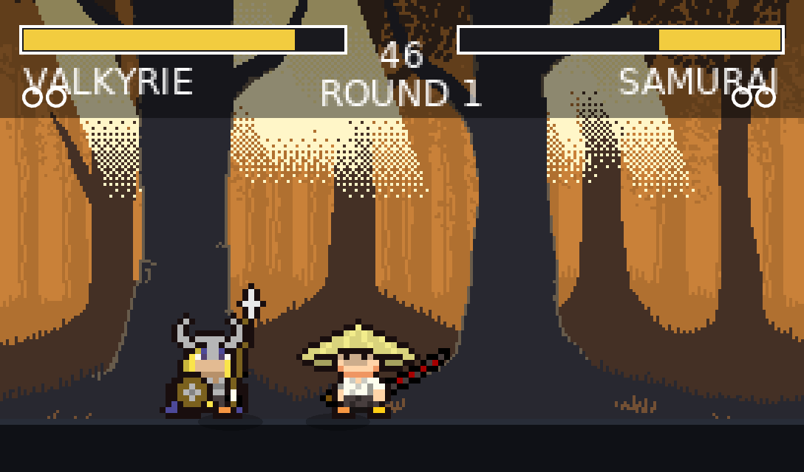
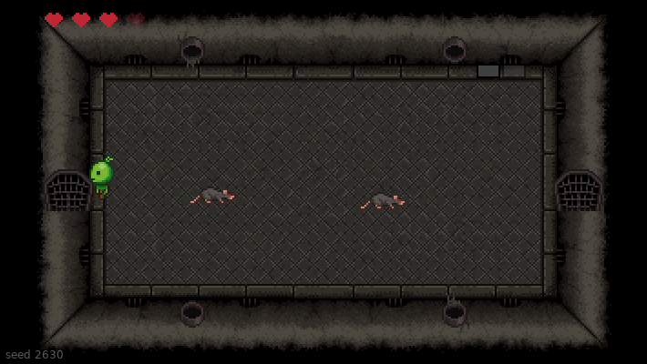

  

Every folder here is a **complete game, written from scratch during a single
live session** on [TEC](https://www.youtube.com/@tanguy_tec). No pre-written
code, no cuts, no second take. The commit lands when the stream ends.

<table>
<tr>
<td width="50%" valign="top">

### [rez-like](rez-like)

Four zones, a swarm, a core with four phases and an ending, and the game plays itself from the title to the end.

C and X11 · 6691 lines · written live in 7 h 31 · <a href="https://youtu.be/jfeygQDTY7s">watch it</a>

</td>
<td width="50%" valign="top">

### [wolfenstein-like](wolfenstein-like)

One ray per column of the screen, a grid of characters for a world, and every pixel drawn by hand.

C and X11 · 5825 lines · written live in 6 h 11 · <a href="https://youtu.be/crEy4UbZ3qs">watch it</a>

</td>
</tr>
<tr>
<td width="50%" valign="top">

### [street-fighter-like](street-fighter-like)

Four fighters, two stages, best of three rounds. The opponent runs a state machine, and left alone the game plays both sides itself.

Lua and LOVE 2D · 665 lines · written live in 2 h 09 · <a href="https://youtu.be/gJOMl3DYnhg">watch it</a>

</td>
<td width="50%" valign="top">

### [binding-of-isaac-like](binding-of-isaac-like)

Twelve rooms grown from a seed, a key in a dead end, a locked boss door, and a boss that charges.

Lua and LOVE 2D · 747 lines · written live in 2 h 14 · <a href="https://youtu.be/-rA3q0Ju6_c">watch it</a>

</td>
</tr>
</table>

Each game has its own README: what it is, how to run it, and how the
interesting part works. They are not all written in the same language, so the
build command lives with the game rather than here.

## Licence

MIT, see [LICENSE](LICENSE).
