<div align="center">



**One game, one stream, from an empty file.**

[](https://love2d.org)
[](https://www.lua.org)
[](https://www.youtube.com/@tanguy_tec)
[](LICENSE)

</div>

Every folder here is a **complete game, written from scratch during a single
live session** on [TEC](https://www.youtube.com/@tanguy_tec). No pre-written
code, no cuts, no second take. The commit lands when the stream ends.

Each game keeps its own README: what it is, how to play it, and how the
interesting part works.

## Latest

<table>
<tr>
<td width="45%">

<a href="street-fighter-like"></a>

</td>
<td valign="top">

### [street-fighter-like](street-fighter-like)

Four fighters, two stages, three rounds. The opponent runs a state machine, and left alone the game plays both sides itself.

Lua, LÖVE 2D, 665 lines, 2 h 09 of stream.

[Watch it being written](https://youtu.be/gJOMl3DYnhg)

</td>
</tr>
</table>

## Everything else

| game | what it is | lines | stream | |
|---|---|---:|---:|---|
| [binding-of-isaac-like](binding-of-isaac-like) | A Binding of Isaac-like: one floor of twelve rooms generated from a seed, a key hidden in a dead end, a locked boss door, five kinds of monster and a boss that charges and fires a cross. | 747 | 2 h 14 | [stream](https://youtu.be/-rA3q0Ju6_c) |

## Running any of them

```sh
cd <the game folder>
love .
```

[LÖVE 11.5](https://love2d.org) is the only thing to install.

## Licence

MIT, see [LICENSE](LICENSE). The sprites come from a prototype I wrote in 2019,
kept in [game_prototype_lua](https://github.com/tanguychenier/game_prototype_lua).
