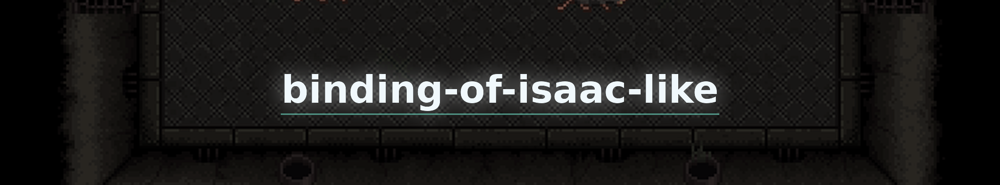
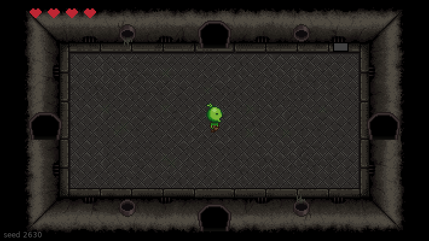
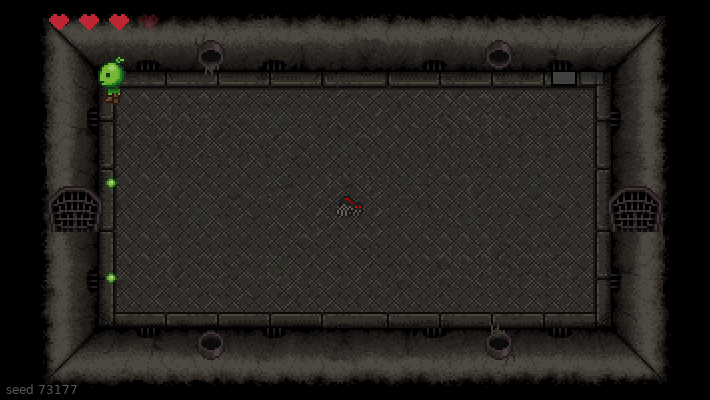

<div align="center">



[](https://youtu.be/-rA3q0Ju6_c) [](https://love2d.org) [](https://www.lua.org) [](../LICENSE)

</div>

A Binding of Isaac-like: one floor of twelve rooms generated from a seed, a key hidden in a dead end, a locked boss door, five kinds of monster and a boss that charges and fires a cross.

Written from an empty file during a single live session, 747 lines in 2 h 14:
**https://youtu.be/-rA3q0Ju6_c**

<div align="center">






</div>

## Running it

```sh
love .
```

[LÖVE 11.5](https://love2d.org) is the only thing to install.

| | |
|---|---|
| `zqsd` / `wasd` | walk |
| arrow keys | shoot |
| `r` | replay the same floor |
| `n` | a new floor |
| `escape` | quit |

The seed is printed in the corner: the same seed always builds the same floor,
which is what makes a run reproducible.

## How the floor is built

Rooms grow outward from the centre, and a candidate cell is **rejected when it
already touches two rooms**. That single rule is what produces branches, and
therefore the dead ends where the boss and the key can be hidden. A
breadth-first pass then measures how far each room sits from the start, so the
boss lands on the farthest dead end and the key on the second farthest.

## Credits

The sprites come from a prototype I wrote in 2019, kept in
[game_prototype_lua](https://github.com/tanguychenier/game_prototype_lua).

The sound effects are synthesised rather than sampled: nothing to license, and
each one is tuned to the game.

Stream music: Scott Buckley, [scottbuckley.com.au](https://www.scottbuckley.com.au)
(CC BY 4.0). Outro: AIRGLOW, "Memory Bank" (CC BY 3.0).
