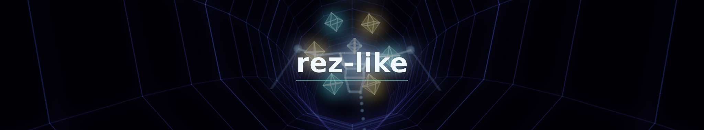
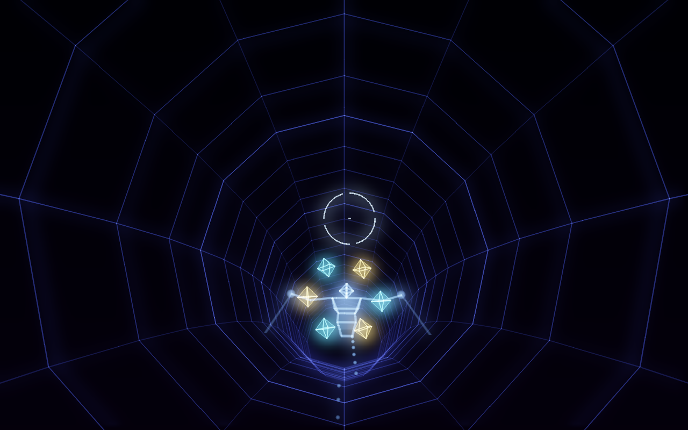
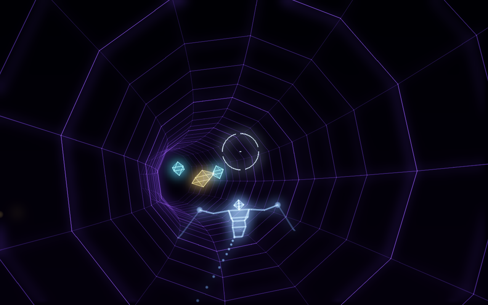
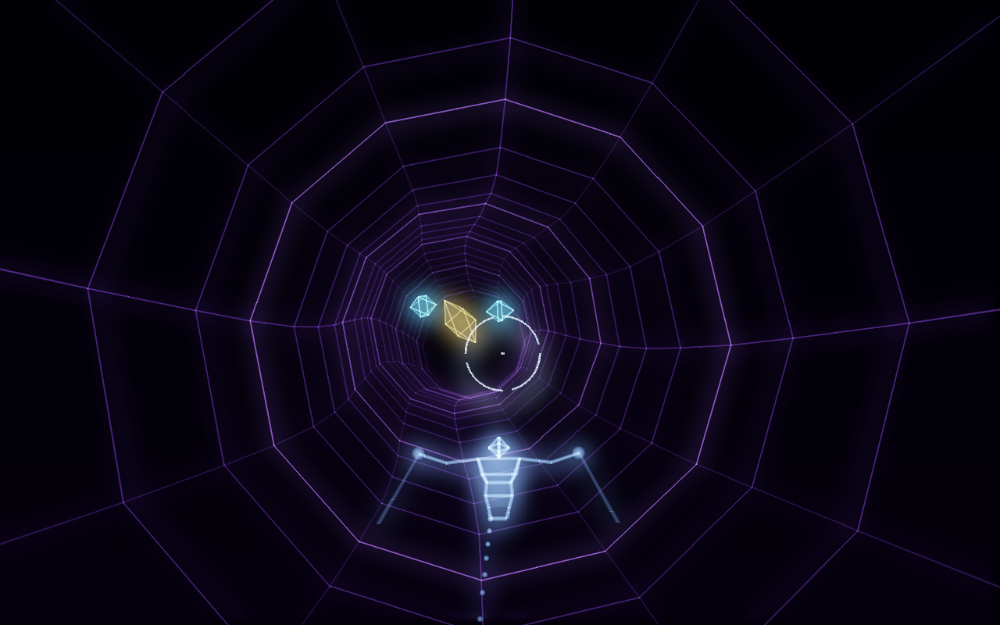
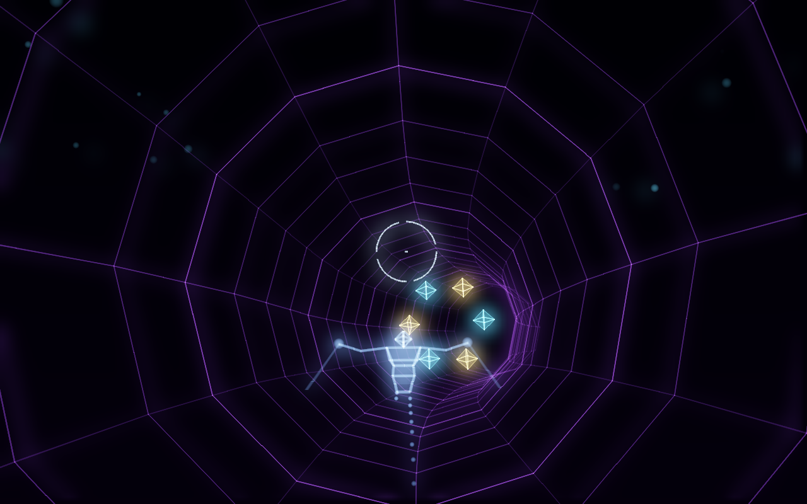

<div align="center">



[](https://youtu.be/j4NwurDLC5c) [](https://en.cppreference.com/w/c) [](https://www.x.org) [](../../LICENSE)

</div>

> **Part 1 of 2**, written during one live session. [All the parts](../) of this game.

AXON, a rail shooter drawn in lines of light, in the spirit of Rez, written in C. A wireframe 3D engine, a rail, a tunnel, targets marked up to eight, and a music the program computes, on which every shot plays a note.

Written from an empty file during a single live session, 3529 lines in 7 h 03.
**https://youtu.be/j4NwurDLC5c**

<div align="center">






</div>

## Running it

```sh
gcc -Wall -Wextra -O2 -Iinclude -o axon src/demo.c src/draw.c src/hero.c src/level.c src/main.c src/mesh.c src/palette.c src/particle.c src/player.c src/rail.c src/screen.c src/sound.c src/thing.c src/tunnel.c -lX11 -lasound -lm && ./axon
```

A C compiler, the X11 headers and the ALSA headers (`libx11-dev` and `libasound2-dev` on Debian and Ubuntu). Nothing else.


