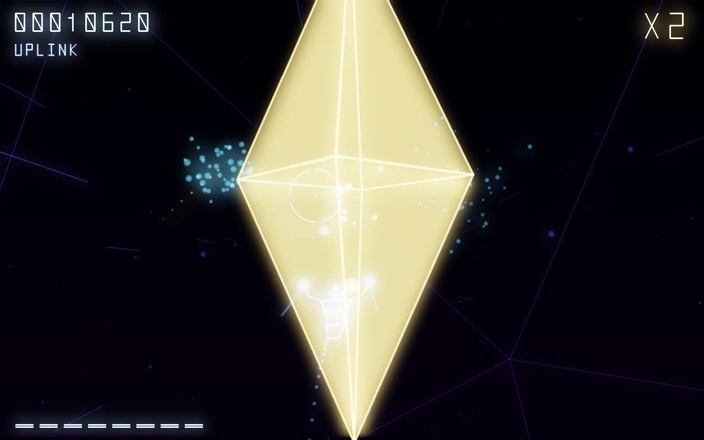
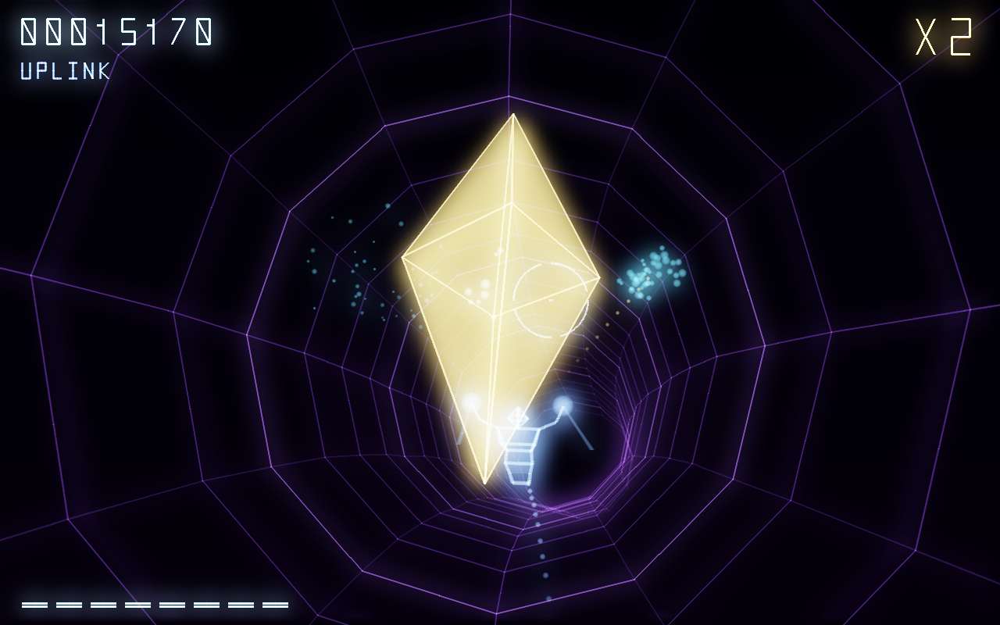

<div align="center">


[](https://youtu.be/jfeygQDTY7s) [](https://en.cppreference.com/w/c) [](https://www.x.org) [](../../LICENSE)

</div>

> **Part 2 of 2**, written during one live session. [All the parts](../) of this game.

AXON, a rail shooter drawn in lines of light, in the spirit of Rez, written in C. The whole game on the engine of part 1, a level in four zones measured in bars of music, a swarm, a HUD drawn in strokes, eight bars of health, a core with four phases, a title screen, a table of the best scores, and a hand of code that plays the game like a person.

Written from an empty file during a single live session, 6691 lines in 7 h 31.
**https://youtu.be/jfeygQDTY7s**

<div align="center">





</div>

## Running it

```sh
gcc -Wall -Wextra -O2 -Iinclude -o axon src/boss.c src/demo.c src/draw.c src/font.c src/hero.c src/level.c src/main.c src/mesh.c src/palette.c src/particle.c src/player.c src/pool.c src/rail.c src/scores.c src/screen.c src/sound.c src/thing.c src/tunnel.c src/world.c -lX11 -lasound -lpthread -lm && ./axon
```

A C compiler, the X11 headers and the ALSA headers (`libx11-dev` and `libasound2-dev` on Debian and Ubuntu). Nothing else.


