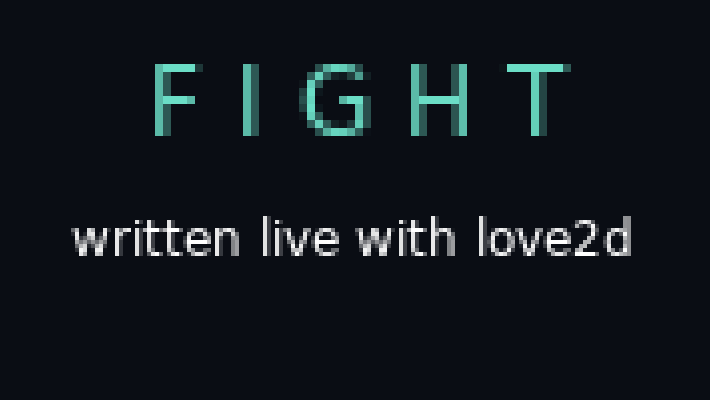
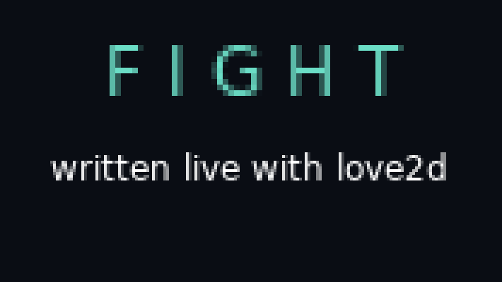
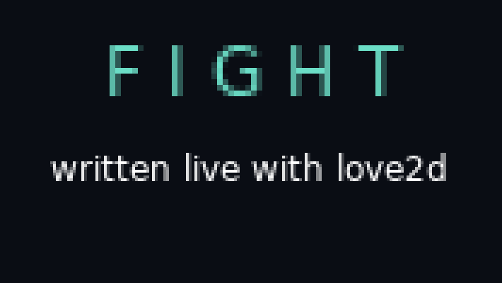

<div align="center">



# street-fighter-like

[](https://youtu.be/gJOMl3DYnhg)
[](https://love2d.org)
[](https://www.lua.org)
[](../LICENSE)

</div>

Four fighters, two stages, three rounds. The opponent runs a state machine, and left alone the game plays both sides itself.

Written from an empty file during a single live session, 665 lines in 2 h 09:
**https://youtu.be/gJOMl3DYnhg**

<div align="center">






</div>

## Playing

```sh
love .
```

| | |
|---|---|
| `q` `d` | walk |
| `z` | jump |
| back away from the opponent | block |
| `j` | light attack |
| `k` | heavy attack |
| `enter` | menus |
| `d` on the title | arcade demo |

Best of three rounds, sixty seconds each. Block by holding away from the
opponent: you still take a quarter of the damage, which is what keeps blocking
from being a free answer to everything.

## How the opponent thinks

The opponent runs a small state machine, re-evaluated every tenth of a second
or so: **close** when out of reach, **hit** when in reach, **block** or **back**
when the other one starts a swing. Every branch carries a bit of randomness and
a reaction delay, because an opponent that answers in one frame reads as a
machine and stops being fun.

The same state machine drives *both* fighters in demo mode, which is what an
arcade cabinet does when nobody is playing.

## The blow that lands

An attack animation is three frames for the ninja and eight for the samurai, so
the active window is expressed as a fraction of the animation rather than a
frame number: the hit lands between 40 % and 85 % of the swing, whatever the
fighter. On impact the whole game freezes for four to seven hundredths of a
second. That freeze is most of what makes a hit feel heavy.

## Credits

The sprites come from a prototype I wrote in 2019, kept in
[game_prototype_lua](https://github.com/tanguychenier/game_prototype_lua).

The sound effects are synthesised rather than taken from a library: nothing to
license, and each one is tuned to the game.

Stream music: Scott Buckley, [scottbuckley.com.au](https://www.scottbuckley.com.au)
(CC BY 4.0). Outro: AIRGLOW, "Memory Bank" (CC BY 3.0).
