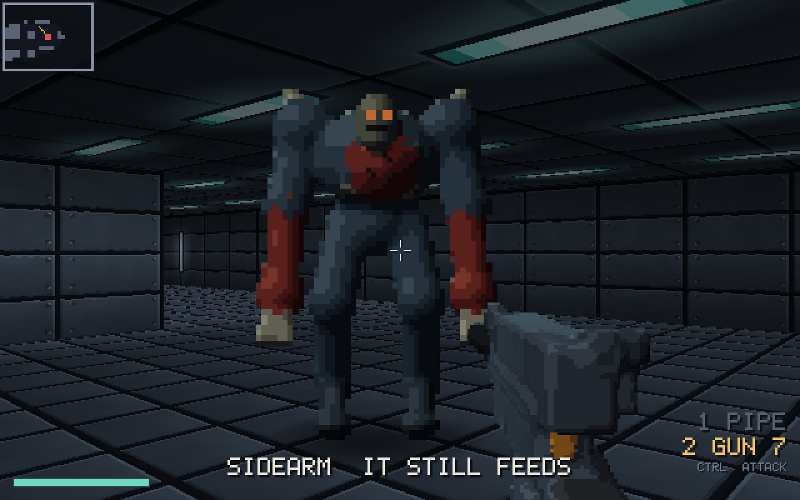
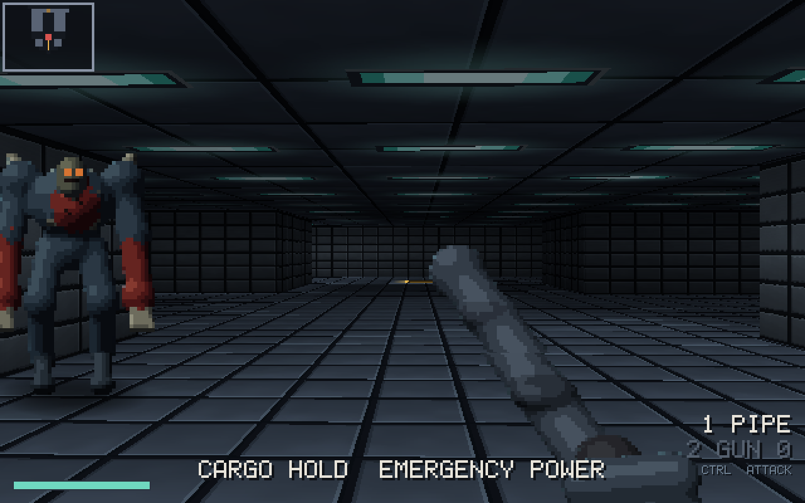
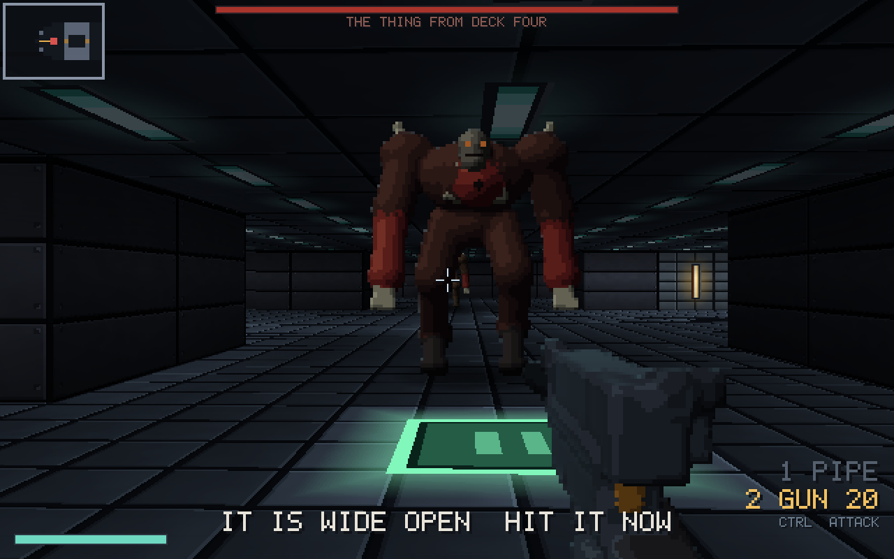

<div align="center">


[](https://youtu.be/crEy4UbZ3qs) [](https://en.cppreference.com/w/c) [](https://www.x.org) [](../../LICENSE)

</div>

> **Part 4 of 4**, written across two live sessions, the first cut short, the second finishing what it began. [All the parts](../) of this game.

The Keep, a first-person engine written in C, in 2.5D, the way Wolfenstein 3D did it. One ray per column of the screen, walking a grid of characters. No game engine and no framework. X11 hands over a window and a block of memory, and every pixel after that is ours.

5825 lines by the end. First video, the fight, the ending of the level and the arcade mode.
**https://youtu.be/ib2nzm4y6aI**

Second video, 6 h 11, the sound, the story, the doors, the crew, the boss, and the level played to the end.
**https://youtu.be/crEy4UbZ3qs**

<div align="center">






</div>

## Running it

```sh
gcc -Wall -Wextra -O2 -Iinclude -o game src/demo.c src/fight.c src/light.c src/main.c src/render.c src/screen.c src/sound.c src/sprite.c src/story.c src/text.c src/texture.c src/thing.c src/trigger.c src/world.c -lX11 -lasound -lm && ./game
```

A C compiler, the X11 headers and the ALSA headers (`libx11-dev` and `libasound2-dev` on Debian and Ubuntu). Nothing else.

| | |
|---|---|
| arrow up / down, `w` `s` | walk forward and back |
| arrow left / right | turn |
| mouse | look, after a click. `escape` gives it back |
| `a` `d` | step sideways |
| `ctrl` | attack |
| `1` `2` | the pipe, the sidearm |
| `space` | open a door |
| `m` | the map |
| `n` | sound on and off |
| `F11` | full screen |
| `escape` | the menu |

No engine, no library, no framework. X11 gives a window and a block of memory,
ALSA takes a stream of numbers, everything else is in `src/`, and one line of
gcc builds it.

## How the walls are drawn

The technique is not new. It is how Wolfenstein 3D drew its corridors in 1992,
and it has been written up many times since. What is here is the
implementation, written from an empty file.

The world is a grid of characters, and a wall is anything that is not a dot.
For each of the 320 columns of the screen, one ray leaves the eye and walks
that grid, always stepping across whichever grid line is nearest, so no
square is ever missed and none is visited twice. Where the ray meets a wall,
the distance it covered decides how tall that wall is drawn. Near is tall, far
is short, and a column of pixels is all it takes.

The distance is measured on the camera plane rather than from the eye. Measured
from the eye, the corners of a straight wall are farther away than its middle,
and the wall bends into a fishbowl.

## The two greys

A wall met on a north-south grid line is drawn a shade darker than one met on
an east-west line. Without that difference every corner of the level
disappears, because two walls at right angles end up the same colour. It costs
one line and it is the whole reason the rooms read as rooms.

## Walking into things

Each axis is tested on its own, so a shoulder against a wall keeps sliding
instead of stopping the player dead. The test looks a fifth of a square ahead
of where the player actually is (the nose), otherwise you walk until your
eyes are inside the texture.
